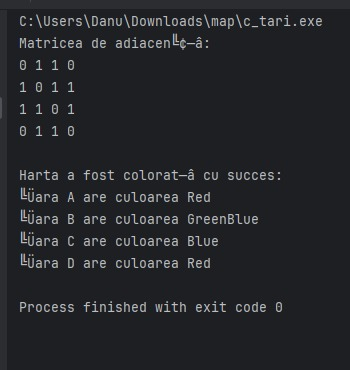

# Map Coloring Project

## Descriere
Acest proiect implementează algoritmul de colorare a hărților utilizând un backtracking simplu. 

Proiectul include două versiuni:
- **Versiunea cu date hardcodate (`c_tari.c`)**: Această versiune a fost creată pentru a facilita observarea și urmărirea mai ușoară a rularii codului. Este utilă pentru a demonstra funcționarea algoritmului în condiții controlate și pentru debugging.
- **Versiunea cu input de la utilizator (`tari_input.c`)**: Această versiune permite introducerea datelor direct de la utilizator și este concepută pentru a demonstra funcționalitatea algoritmului în scenarii reale.

Ambele versiuni utilizează o matrice de adiacență pentru a reprezenta relațiile dintre țări și implementează o soluție de backtracking pentru colorarea corectă a hărții.
Implementarea este efectuata cu grafuri , si se foloseste structura clasica pentru parcurgerea grafurilor cu vector de vizitate.
Am facut proiectul in clion(ide-ul meu preferat pentru c)




## Structura proiectului
- `c_tari.c`: Versiunea cu date hardcodate.
- `tari_input.c`: Versiunea care acceptă input de la utilizator.

## Cum se rulează
### Local
1. Compilează folosind GCC:
   ```bash
   gcc -o map_hardcoded c_tari.c
   gcc -o map_input tari_input.c
